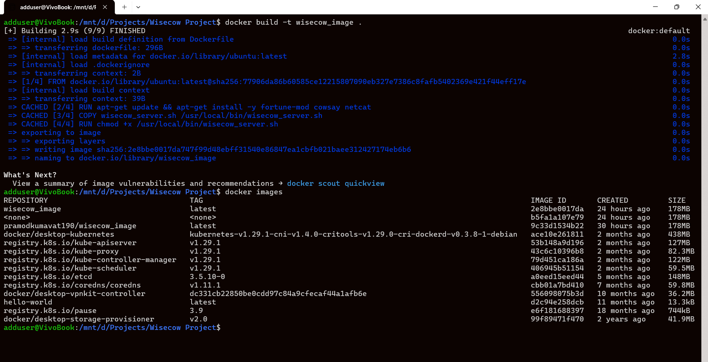
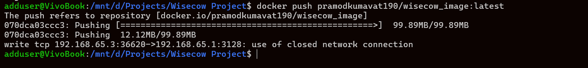
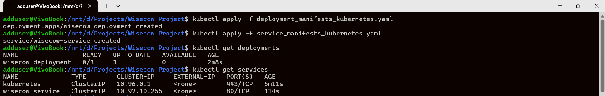
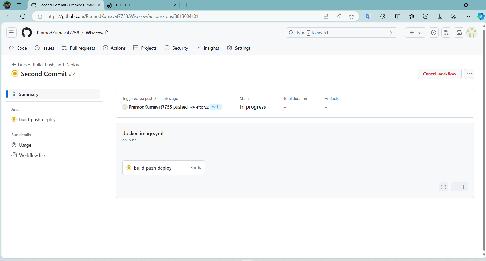
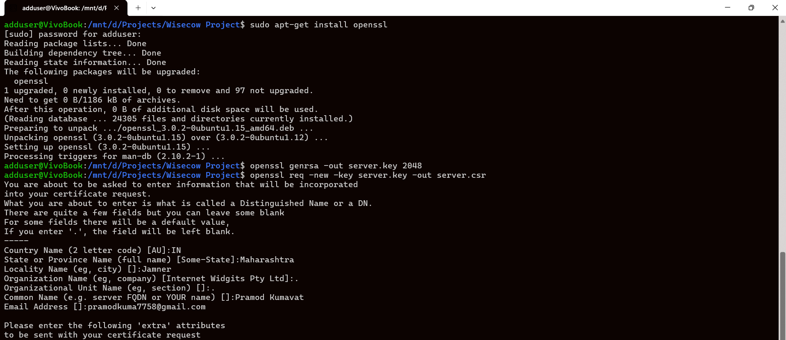
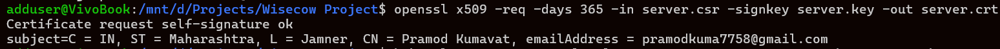
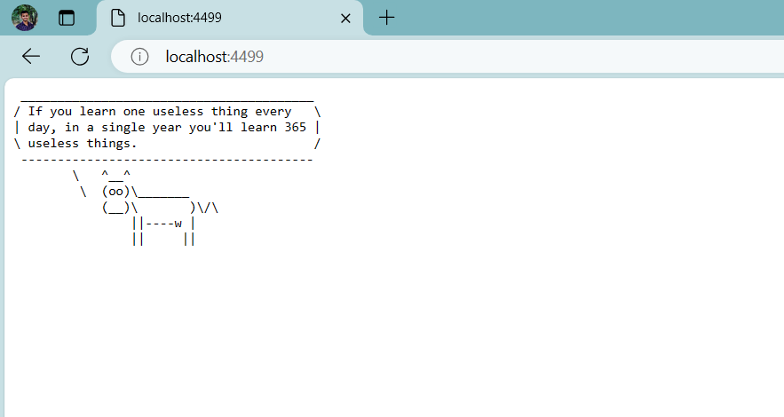

# Cow wisdom  - Accuknox
## Problem Statement - 1
## Title: Containerization and Deployment of Wisecow Application on Kubernetes 
Objective : To containerize and deploy the Wisecow application, hosted in the
above-mentioned GitHub repository, on a Kubernetes environment with secure TLS
communication. 
Note: In this deployment we are using local Kubernetes cluster and application will run on localhost.


- Create Docker file 
- Create Docker Image
- Deploy container on Kubernetes Environment
- Secure TLS communication
  

## Getting Started

To run this project on your local machine, follow these steps:

1. **Installation:**

You can install `fortune-mod` and `cowsay` on Debian-based systems like Ubuntu using the following commands:

```bash
sudo apt update
sudo apt install fortune-mod cowsay -y
```


2. **Dockerization**
   1. Create docker file with the name **Dockerfile** , navigate to the path of file and execute.
   2. Build the Dockerfile using below command.
      
      ```bash
      docker build -t wisecow-image .
      ```
   
   
   3. Create repository/ container registry to Dockerhub and push the image with proper tag to it.
      
      ```bash
      docker push _yourRepositoryName_/wisecow_image:latest
      ```

   
   

2. **Kubernetes Deployment :**
 
   1. Create Kubernetes deployment manifest files for deploying the Wisecow application in a Kubernetes environment. ex : deployment_manifests_kubernetes.yaml
   2. Create service file exposed as a Kubernetes service for accessibility. ex : service_manifests_kubernetes.yaml
   3. Apply the deployment and service using following commands.

   ```bash
   kubectl apply -f deployment_manifests_kubernetes.yaml
   kubectl apply -f service_manifests_kubernetes.yaml
   ```
      
   4. Check deployments and services running.Use commands.
      
    ```bash
   kubectl get deployments
   kubectl get services
   ```
    
   
5. **Continuous Integration And Deployment**
   1.Github workflow for
   a. Create yaml file in ./github/workflows
   b. Set the secrets **secrets.DOCKER_USERNAME** and **secrets.DOCKER_PASSWORD** with your Dockerhub username and docker image name.
   
   

6. **TLS Implementaion**
   1. Install OpenSSL.
      
   ```bash
   sudo apt-get install openssl  
   ```
   

   
   2. Generate Private Key.
      
   ```bash
   openssl genrsa -out server.key 2048
   ```
   3. Generate Certificate Signing Request (CSR)
      
   ```bash
   openssl req -new -key server.key -out server.csr
   ```
   4. Self-Sign Certificate
      
   ```bash
   openssl x509 -req -days 365 -in server.csr -signkey server.key -out server.crt
   ```

   
   5. Deploy to Kubernetes. Reference this TLS secret in Kubernetes deployment configuration to enable TLS
      
   ```bash
   kubectl create secret tls tls-secret --cert=server.crt --key=server.key
   ```
7. **Output**
   
---

Feel free to customize this README to provide more specific information about your project. Include any additional setup instructions, prerequisites, or specific details about your application that you think would be helpful for users.
